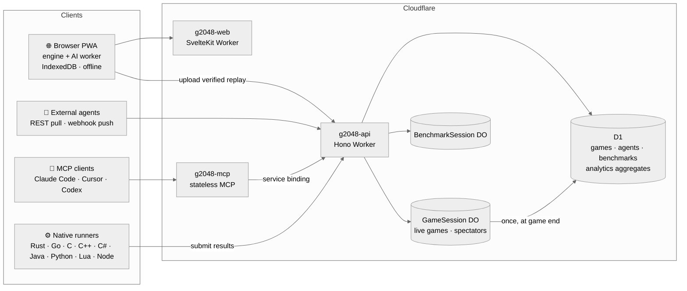

<div align="center">


# 2048 Lab

**A deterministic 2048 platform for humans, AI agents and cross-language benchmarking.**

Play in the browser, watch AI agents live, replay any game from a 12-character code,<br/>
and race nine language engines on the *exact same* games.

[**Play now →**](https://2048.ifsvivek.in) &nbsp;·&nbsp;
[API](https://2048api.ifsvivek.in/v1/health) &nbsp;·&nbsp;
[MCP server](docs/MCP.md) &nbsp;·&nbsp;
[Spec](spec/SPEC.md) &nbsp;·&nbsp;
[Architecture](docs/architecture.md)


<br/>


</div>

---

## ✨ Highlights

<table>
<tr>
<td width="50%" valign="top">

### 🎯 Bit-identical in nine languages
Same seed + same moves ⇒ the **same board history** in TypeScript, Rust, Go,
Python, C, C++, C#, Java and Lua. The expectimax AI even makes the **same decision with the same
float64 value**. 9,228 shared fixture checks enforce it.

</td>
<td width="50%" valign="top">

### 🔁 Replays from a short code
Every finished game gets a human-friendly code like `A7KF-29LM-XQ4P`.
Anyone can watch it — play, pause, step, jump, change speed — and the
browser re-verifies it against the stored hash.

</td>
</tr>
<tr>
<td valign="top">

### 🤖 Agents of every kind
Built-in expectimax, greedy and random agents; external agents over REST
(pull) or a `POST /decide` webhook (push); AI assistants over **MCP**;
and an **LLM agent** constrained to legal moves.

</td>
<td valign="top">

### 📊 Benchmarks & analytics
Shared, reproducible suites with verified checksums; a runtime
comparison dashboard; and analytics for growth, retention, score
percentiles, tile achievements and per-agent performance.

</td>
</tr>
<tr>
<td valign="top">

### 📴 Offline-first
Games run entirely in the browser (AI in a Web Worker), are saved to
IndexedDB, and sync one verified replay when you're back online.

</td>
<td valign="top">

### 🪶 Built for the free tier
No per-move database writes, aggregate-only dashboards, edge caching,
and Durable Objects only where coordination actually matters.

</td>
</tr>
</table>

## 🏁 Same games, different speeds

Because every runtime plays identical games, a benchmark measures **speed and
nothing else**. Every language below produces the same checksum on every suite.

| Language | Runtime | Engine, random agent<br/><sub>moves/s</sub> | Expectimax d2<br/><sub>time / decision</sub> | Expectimax d3<br/><sub>search nodes/s</sub> | Peak memory<br/><sub>d2 suite</sub> | Canonical AI<br/><sub>time / decision</sub> |
|---|---|--:|--:|--:|--:|--:|
| Rust | native 1.98 | **4.25 M** | 12.5 µs | 71.7 M | 27 MB | 1.8 ms |
| C | gcc 16 | 3.99 M | 11.1 µs | 72.8 M | **20 MB** | 1.8 ms |
| C++ | g++ 16 | 3.72 M | 11.6 µs | 67.1 M | 30 MB | 1.7 ms |
| Go | go 1.27 | 2.91 M | **11.1 µs** | **75.7 M** | 35 MB | 1.8 ms |
| Java | OpenJDK 26 | 2.85 M | 13.5 µs | 67.4 M | 96 MB | **1.5 ms** |
| C# | .NET 9 | 2.84 M | 14.2 µs | 55.7 M | 67 MB | 1.6 ms |
| TypeScript | Node 26 | 1.08 M | 24.3 µs | 35.2 M | 114 MB | 3.7 ms |
| Lua | Lua 5.5 | 276 K | 111 µs | 7.4 M | 39 MB | 16 ms |
| Python | CPython 3.14 | 89 K | 306 µs | 2.8 M | 229 MB | 43 ms |

Every language scores the same on the canonical suite (auto depth 2–4, 3 games): an average of **168,737**.

<sub>AMD Ryzen 7 5800H · reproduce with <code>pnpm bench</code> · live numbers on the <a href="https://2048.ifsvivek.in/runtimes">runtime dashboard</a></sub>

```text
$ pnpm validate
  typescript  ok   1106 passed, 0 failed
  rust        ok    407 passed, 0 failed
  go          ok   1114 passed, 0 failed
  python      ok   1031 passed, 0 failed
  c           ok   1114 passed, 0 failed
  cpp         ok   1114 passed, 0 failed
  java        ok   1114 passed, 0 failed
  csharp      ok   1114 passed, 0 failed
  lua         ok   1114 passed, 0 failed
  engine-random-1k   expected 3d653498   typescript=… rust=… go=… python=… c=… cpp=… java=… csharp=… lua=3d653498   IDENTICAL
  expectimax-d2-10   expected 33601a3a   typescript=… rust=… go=… python=… c=… cpp=… java=… csharp=… lua=33601a3a   IDENTICAL
```

## 📸 Tour

<table>
<tr>
<td width="50%"><p align="center"><sub><b>Landing</b> — start a game or open a replay</sub></p></td>
<td width="50%"><p align="center"><sub><b>Replay viewer</b> — verified, step-by-step playback</sub></p></td>
</tr>
<tr>
<td><p align="center"><sub><b>Runtime comparison</b> — nine languages, one checksum</sub></p></td>
<td><p align="center"><sub><b>Analytics</b> — growth, players, scores, agents</sub></p></td>
</tr>
</table>

<p align="center"><br/><sub><b>Mobile</b> — swipe to play, works offline</sub></p>

## 🧭 Architecture



**Key decisions** — each has a short record in [`docs/adr`](docs/adr):
[canonical spec & fixtures](docs/adr/0001-canonical-spec-and-fixtures.md) ·
[Durable Objects](docs/adr/0002-durable-objects.md) ·
[offline-first & identities](docs/adr/0003-offline-first-and-identities.md) ·
[analytics](docs/adr/0004-analytics.md) ·
[MCP](docs/adr/0005-mcp.md) ·
[free-tier budget](docs/adr/0006-free-tier-budget.md)

## 🚀 Quick start

```bash
pnpm install
pnpm test          # TypeScript unit + fixture tests
pnpm validate      # all nine languages against the shared fixtures
```

<details>
<summary><b>Run the whole stack locally</b></summary>

```bash
pnpm --filter @g2048/api db:migrate:local
pnpm dev:api                      # API  → http://localhost:8787
pnpm --filter @g2048/mcp dev      # MCP  → http://localhost:8788/mcp
pnpm dev:web                      # Web  → http://localhost:5173

node tools/src/smoke-api.ts       # end-to-end API checks vs the reference engine
node tools/src/smoke-mcp.ts       # plays a whole game through MCP (official SDK client)
node tools/src/seed-demo.ts       # synthetic history for the analytics dashboard (localhost only)
```
</details>

<details>
<summary><b>Benchmarks</b></summary>

```bash
pnpm bench                                                    # default suites, every runtime
pnpm bench --suites expectimax-canonical-3 --lang rust,go     # pick suites / languages
pnpm bench --submit https://2048api.ifsvivek.in    # publish (checksums are verified)
pnpm bench --suites engine-random-1k,engine-random-10k,expectimax-d2-10,expectimax-d3-opening,expectimax-canonical-3 --submit https://2048api.ifsvivek.in --all  # all suites × all runtimes + publish (includes slow Python canonical)
```

Suites live in [`spec/benchmarks`](spec/benchmarks); results follow
[`benchmark-result.schema.json`](spec/schemas/benchmark-result.schema.json).
</details>

<details>
<summary><b>Deploy (Cloudflare)</b></summary>

```bash
cd apps/api && npx wrangler d1 migrations apply g2048 --remote && npx wrangler deploy
cd apps/mcp && npx wrangler deploy
cd apps/web && pnpm run deploy
```
</details>

## 🤝 Bring your own agent

| Integration | How | Example |
|---|---|---|
| **REST (pull)** | `POST /v1/games`, then `POST /v1/games/{id}/moves` until `status` is `over` — every response is the full state | [`agents/python-api-agent`](agents/python-api-agent/play.py) |
| **Webhook (push)** | Serve `POST /decide`, register it, and the platform plays your agent live | `g2048 serve` in [Rust](engines/rust), [Go](engines/go), [Python](engines/python) |
| **MCP** | `claude mcp add --transport http g2048 https://2048mcp.ifsvivek.in/mcp` | [`docs/MCP.md`](docs/MCP.md) |
| **LLM** | Free OpenRouter model by default, or Claude; answers are schema-restricted to legal moves | [`agents/llm-agent`](agents/llm-agent/agent.py) |

```bash
curl -s -X POST https://2048api.ifsvivek.in/v1/games -d '{"seed": 42}'
curl -s -X POST https://2048api.ifsvivek.in/v1/games/$GAME_ID/moves -d '{"move": "left"}'
```

Full contract: [`spec/openapi.yaml`](spec/openapi.yaml) · agent protocol: [`spec/AGENT_PROTOCOL.md`](spec/AGENT_PROTOCOL.md)

## 🗂️ Repository

| Path | What's inside |
|---|---|
| [`spec/`](spec) | Game & AI specs, agent protocol, OpenAPI, JSON schemas, **cross-language fixtures**, benchmark suites |
| [`packages/engine`](packages/engine) | TypeScript reference engine, expectimax, simulation & benchmark core |
| [`engines/rust`](engines/rust) · [`engines/go`](engines/go) · [`engines/python`](engines/python) | Ports with `validate` / `bench` / `play` / `serve` CLIs (Python also ships an API client) |
| [`engines/c`](engines/c) · [`engines/cpp`](engines/cpp) · [`engines/csharp`](engines/csharp) · [`engines/java`](engines/java) · [`engines/lua`](engines/lua) | Standard-library-only ports with `validate` / `bench` / `play` CLIs, each built with `make` |
| [`apps/api`](apps/api) | Hono API on Workers · D1 · Durable Objects · daily analytics cron |
| [`apps/mcp`](apps/mcp) | MCP server — Hono, Streamable HTTP, stateless, service-bound to the API |
| [`apps/web`](apps/web) | SvelteKit + Tailwind frontend (Worker, offline-first PWA) |
| [`agents/`](agents) | Example external agents |
| [`tools/`](tools) | Fixture generation, cross-language validation, benchmarks, smoke & visual tests |
| [`docs/`](docs) | Architecture, decision records, MCP guide |

<div align="center">
<sub>Every game is a seed and a list of moves — everything else is derived.</sub>
</div>
